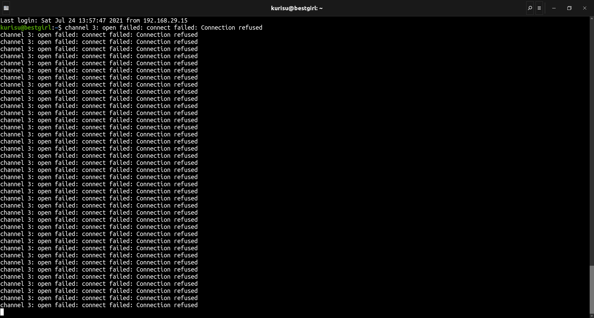

# Week 5: Command-line Environment

## Job Control

1. From what we have seen, we can use some `ps aux | grep` commands to get our jobs’ pids and then kill them, but there are better ways to do it. Start a `sleep 10000` job in a terminal, background it with `Ctrl-Z` and continue its execution with `bg`. Now use `pgrep` to find its pid and `pkill` to kill it without ever typing the pid itself. (Hint: use the `-af` flags).
    #### **Solution:**
    1.
        ```bash
        sleep 10000
        ^Z
        [3]+  Stopped                 sleep 10000
        
        bg
        [3]+ sleep 10000 &
        ```
        `bg` resumes the most recently suspended job and runs it in the background

    2.
        ```bash
        pgrep -af "sleep 10000$"
        160 sleep 10000
        ```
        * `-a` lists PID and full command line
        * `-f` uses full process name to match
        * `$` avoids matching similar processes such as `sleep 1000000`
        ```bash
        pkill -f "sleep 10000$"
        [3]+  Terminated              sleep 10000
        ```

2. Say you don’t want to start a process until another completes. How would you go about it? In this exercise, our limiting process will always be `sleep 60 &`. One way to achieve this is to use the `wait` command. Try launching the sleep command and having an `ls` wait until the background process finishes. 

    However, this strategy will fail if we start in a different bash session, since `wait` only works for child processes. One feature we did not discuss in the notes is that the `kill` command’s exit status will be zero on success and nonzero otherwise. `kill -0` does not send a signal but will give a nonzero exit status if the process does not exist. Write a bash function called `pidwait` that takes a pid and waits until the given process completes. You should use `sleep` to avoid wasting CPU unnecessarily.
    #### **Solution:**

    1.
        ```bash
        sleep 60 &
        wait $! && ls
        ```
        `$!` expands to the PID of the most recently executed command in the background

    2.  Create a bash script named `pidwait.sh` and save the `pidwait` function in it:
        ```bash
        #!/usr/bin/env bash
        function pidwait()
        {
                while kill -0 $1 2>/dev/null
                do
                        sleep 1
                done
                ls
        }
        ```
        * Redirecting STDERR to null prevents the unwanted error message when sleep is done
        * After sourcing it, `pidwait` can be called in the following manner:
        ```bash
        sleep 10 &
        pidwait $(pgrep sleep)
        ```

## Terminal multiplexer

1.  Follow [this](https://www.hamvocke.com/blog/a-quick-and-easy-guide-to-tmux/) `tmux` tutorial and then learn how to do some basic customizations following [these steps](https://www.hamvocke.com/blog/a-guide-to-customizing-your-tmux-conf/).
    #### **Solution:**
    (Follow the two tutorials.)

## Aliases

1. Create an alias `dc` that resolves to `cd` for when you type it wrongly.
    #### **Solution:**
    ```bash
    alias dc=cd
    ```

2.  Run `history | awk '{$1="";print substr($0,2)}' | sort | uniq -c | sort -n | tail -n 10` to get your top 10 most used commands and consider writing shorter aliases for them. Note: this works for Bash; if you’re using ZSH, use `history 1` instead of just `history`.
    #### **Solution:**
    (Execute the commands given in the question, then make aliases similar to 1.)

## Dotfiles

1. Create a folder for your dotfiles and set up version cont#rol.
    #### **Solution:**
    
    Prerequisite: Install git(`sudo apt install git`)
    ```bash
    cd ~
    mkdir dotfiles
    cd dotfiles
    git init
    ```
    This will create a new directory named `dotfiles` in my home(`~`) directory and initialize a git repository inside it.
2. Add a configuration for at least one program, e.g. your shell, with some customization (to start off, it can be something as simple as customizing your shell prompt by setting `$PS#1`).

    #### **Solution:**
    This is subjective, so you are free to make your own customizations. I will copy my existing `.bashrc` and modify it so that I retain my current color scheme and aliases.
    
    ```bash
    cp ~/.bashrc bashrc
    vim bashrc
    ```

    This was my `bashrc`:
    <details>
    
    ```bash
    # ~/.bashrc: executed by bash(1) for non-login shells.
    # see /usr/share/doc/bash/examples/startup-files (in the package bash-doc)
    # for examples

    # If not running interactively, don't do anything
    case $- in
        *i*) ;;
        *) return;;
    esac

    # don't put duplicate lines or lines starting with space in the history.
    # See bash(1) for more options
    HISTCONTROL=ignoreboth

    # append to the history file, don't overwrite it
    shopt -s histappend

    # for setting history length see HISTSIZE and HISTFILESIZE in bash(1)
    HISTSIZE=1000
    HISTFILESIZE=2000

    # check the window size after each command and, if necessary,
    # update the values of LINES and COLUMNS.
    shopt -s checkwinsize

    # If set, the pattern "**" used in a pathname expansion context will
    # match all files and zero or more directories and subdirectories.
    #shopt -s globstar

    # make less more friendly for non-text input files, see lesspipe(1)
    [ -x /usr/bin/lesspipe ] && eval "$(SHELL=/bin/sh lesspipe)"

    # set variable identifying the chroot you work in (used in the prompt below)
    if [ -z "${debian_chroot:-}" ] && [ -r /etc/debian_chroot ]; then
        debian_chroot=$(cat /etc/debian_chroot)
    fi

    # set a fancy prompt (non-color, unless we know we "want" color)
    case "$TERM" in
        xterm-color|*-256color) color_prompt=yes;;
    esac

    # uncomment for a colored prompt, if the terminal has the capability; turned
    # off by default to not distract the user: the focus in a terminal window
    # should be on the output of commands, not on the prompt
    #force_color_prompt=yes

    if [ -n "$force_color_prompt" ]; then
        if [ -x /usr/bin/tput ] && tput setaf 1 >&/dev/null; then
        # We have color support; assume it's compliant with Ecma-48
        # (ISO/IEC-6429). (Lack of such support is extremely rare, and such
        # a case would tend to support setf rather than setaf.)
        color_prompt=yes
        else
        color_prompt=
        fi
    fi

    if [ "$color_prompt" = yes ]; then
        PS1='${debian_chroot:+($debian_chroot)}\[\033[01;32m\]\u@\h\[\033[00m\]:\[\033[01;34m\]\w\[\033[00m\]\$ '
    else
        PS1='${debian_chroot:+($debian_chroot)}\u@\h:\w\$ '
    fi
    unset color_prompt force_color_prompt

    # If this is an xterm set the title to user@host:dir
    case "$TERM" in
    xterm*|rxvt*)
        PS1="\[\e]0;${debian_chroot:+($debian_chroot)}\u@\h: \w\a\]$PS1"
        ;;
    *)
        ;;
    esac

    # enable color support of ls and also add handy aliases
    if [ -x /usr/bin/dircolors ]; then
        test -r ~/.dircolors && eval "$(dircolors -b ~/.dircolors)" || eval "$(dircolors -b)"
        alias ls='ls --color=auto'
        #alias dir='dir --color=auto'
        #alias vdir='vdir --color=auto'

        alias grep='grep --color=auto'
        alias fgrep='fgrep --color=auto'
        alias egrep='egrep --color=auto'
    fi

    # colored GCC warnings and errors
    #export GCC_COLORS='error=01;31:warning=01;35:note=01;36:caret=01;32:locus=01:quote=01'

    # some more ls aliases
    alias ll='ls -alF'
    alias la='ls -A'
    alias l='ls -CF'

    # Add an "alert" alias for long running commands.  Use like so:
    #   sleep 10; alert
    alias alert='notify-send --urgency=low -i "$([ $? = 0 ] && echo terminal || echo error)" "$(history|tail -n1|sed -e '\''s/^\s*[0-9]\+\s*//;s/[;&|]\s*alert$//'\'')"'

    # Alias definitions.
    # You may want to put all your additions into a separate file like
    # ~/.bash_aliases, instead of adding them here directly.
    # See /usr/share/doc/bash-doc/examples in the bash-doc package.

    if [ -f ~/.bash_aliases ]; then
        . ~/.bash_aliases
    fi

    # enable programmable completion features (you don't need to enable
    # this, if it's already enabled in /etc/bash.bashrc and /etc/profile
    # sources /etc/bash.bashrc).
    if ! shopt -oq posix; then
    if [ -f /usr/share/bash-completion/bash_completion ]; then
        . /usr/share/bash-completion/bash_completion
    elif [ -f /etc/bash_completion ]; then
        . /etc/bash_completion
    fi
    fi
    . "$HOME/.cargo/env"
    ```
    </details>

    Here, `\u` refers to the username of the current user, `\h` refers to the hostname and `\w` refers to the current working directory. `\[\033[01;34m\]` and similar sequences represent colors. `\[` is for start and `\]` is for end of a sequence of non-printable characters. The ANSI code for the color is enclosed between them. Refer to [this](https://stackoverflow.com/a/28938235) StackOverflow answer for more details.

    I  edited the shell prompt by replacing the current user and the hostname:
    ```bash
    if [ "$color_prompt" = yes ]; then
    PS1='${debian_chroot:+($debian_chroot)}\[\033[01;32m\]Tuturu@Okarin\[\033[00m\]:\[\033[01;34m\]\w\[\033[00m\]\$ '
    else
        PS1='${debian_chroot:+($debian_chroot)}Tuturu@Okarin:\w\$ '
    fi
    ```

3. Set up a method to install your dotfiles quickly (and without manual effort) on a new machine. This can be as simple as a shell script that calls `ln -s` for each file, or you could use a [specialized utility](https://dotfiles.github.io/utilitie#s/).

    #### **Solution:**
    Create a file named `install`, give it executable permission(`chmod +x install`) and save the following in it:
    ```bash
    #!/usr/bin/env bash

    BASEDIR=$(dirname $0)
    cd $BASEDIR

    ln -sf ${PWD}/bashrc ~/.bashrc
    ```
    (If you are adding more dotfiles, then symlink them as well. The force(`-f`) flag prevents the `failed to create symbolic link... File exists` error.)

4. Test your installation script on a fresh virtual machine.

    #### **Solution:**
    This can be done by copying the dotfiles folder and running install(`./install`).

5. Migrate all of your current tool configurations to your dotfiles repository.

    #### **Solution:**
    1. Set up git config if you haven't already:
        ```bash
        git config --global user.name "Your Name"
        git config --global user.email you@example.com
        ```
    2. Add all files in `dotfiles` to the staging area and commit.
        ```bash
        git add.
        git commit -m "Add bashrc, install"
        ```

6. Publish your dotfiles on GitHub.

    #### **Solution:**
    Prerequisite: A [Github](https://github.com/) account
    1. Go to your Github profile and navigate to "Repostiories" tab. Create a new empty repository named dotfiles by clicking on "New". **Do not** add a README or .gitignore or license.
    2. Follow the instructions under "…or push an existing repository from the command line" to publish your dotfiles on Github.

## Remote Machines

Install a Linux virtual machine (or use an already existing one) for this exercise. If you are not familiar with virtual machines check out [this](https://hibbard.eu/install-ubuntu-virtual-box/) tutorial for installing one.
### **Solution:**
I had Ubuntu 20.04.2 on my local machine and Ubuntu Server 20.04.2 LTS on my VM. Follow everthing in the tutorial before "Starting and Stopping VirtualBox in Headless Mode". Select "Option 2" while downloading Ubuntu Server to get the iso file. I had to [disable EFI Secure Boot](https://wiki.ubuntu.com/UEFI/SecureBoot/DKMS) in order to get VirtualBox to work. I also had to install `net-tools`(`sudo apt install net-tools`) on my VM for `ifconfig`. This is where I found the IP address assigned to your main network adapter:


1.  Go to `~/.ssh/` and check if you have a pair of SSH keys there. If not, generate them with `ssh-keygen -o -a 100 -t ed25519`. It is recommended that you use a password and use `ssh-agent`, more info [here](https://www.ssh.com/ssh/agent).
    #### **Solution:**
    Execute the command on your local machine. `ssh-agent` is not neccessary.

    

2.  Edit `.ssh/config` to have an entry as follows
    ```bash[img2](Week-5-Screenshots/img2.png)
    Host vm
        User username_goes_here
        HostName ip_goes_here
        IdentityFile ~/.ssh/id_ed25519
        LocalForward 9999 localhost:8888
    ```
    Use `ssh-copy-id vm` to copy your ssh key to the server.
    Start a webserver in your VM by executing `python -m http.server 8888`. Access the VM webserver by navigating to `http://localhost:9999` in your machine.
    #### **Solution:**
    Start your VM and login(if you haven't already). The first two tasks have to be done on your local machine. I had to use `python3 -m http.server 8888` to start a webserver in my VM. To access the VM webserver, do `ssh vm` and open `http://localhost:9999` in your browser. It should look like this:
    
    

    You can download files and check if it matches the VM.

    

3.  Edit your SSH server config by doing `sudo vim /etc/ssh/sshd_config` and disable password authentication by editing the value of `PasswordAuthentication`. Disable root login by editing the value of `PermitRootLogin`. Restart the `ssh` service with `sudo service sshd restart`. Try sshing in again.
    #### **Solution:**
    The file is present on your VM, but you can edit it from your local machine as well since you can access it. Set `Password Authentication` and `PermitRootLogin` to `no`. `PermitRootLogin` was commented on my file, so I uncommented it. 
    
    
    
    `exit` from the server on your local machine and do `sudo service sshd restart` on your VM to restart the `ssh` service. Your server will now only accept key based login and the root user can not login with password. Now ssh login is only allowed with SSH keys and not passwords, adding a layer of extra security.

    Trying to access the server from your local machine(`ssh vm`) should give an output similar to this:
    

    `http://localhost:9999` should not load either.

4.  (Challenge) Install [`mosh`](https://mosh.org/) in the VM and establish a connection. Then disconnect the network adapter of the server/VM. Can mosh properly recover from it?
    #### **Solution:**
    `sudo apt install mosh` will install `mosh` in the VM. `ssh vm` should connect to your VM now. Disabling the WiFi on your local machine or disconnecting the network adapter of the server/VM would prevent you from accessing the server, but your connection would remain intact and you can access it again by enabling WiFi or connecting the network adapter.

5.  (Challenge) Look into what the `-N` and `-f` flags do in `ssh` and figure out a command to achieve background port forwarding.
    #### **Solution:**
    ```bash
    ssh -fN -L 9999:localhost:8888 vm
    ```
    [Here](https://mpharrigan.com/2016/05/17/background-ssh.html) is a helpful article on background port forwarding that also explains the above command.